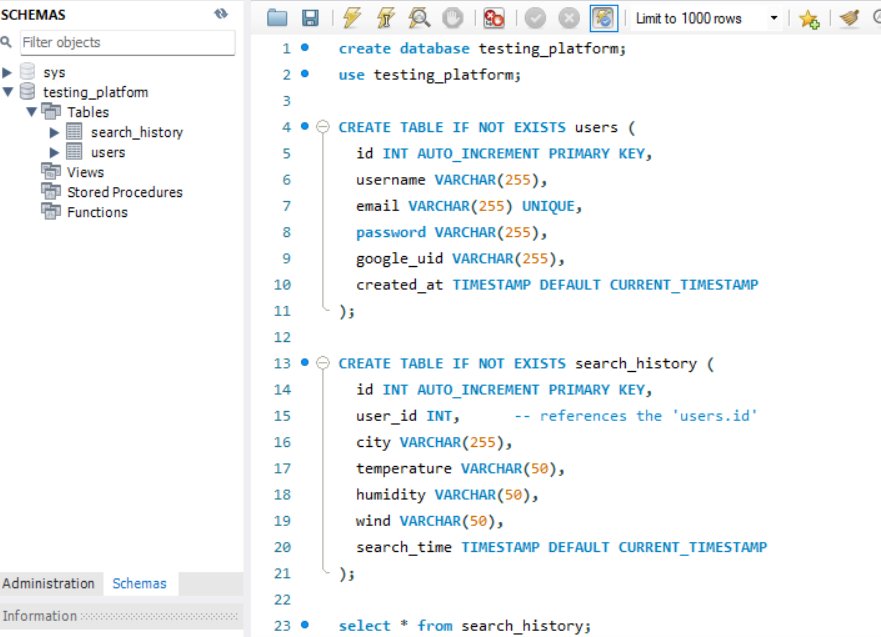
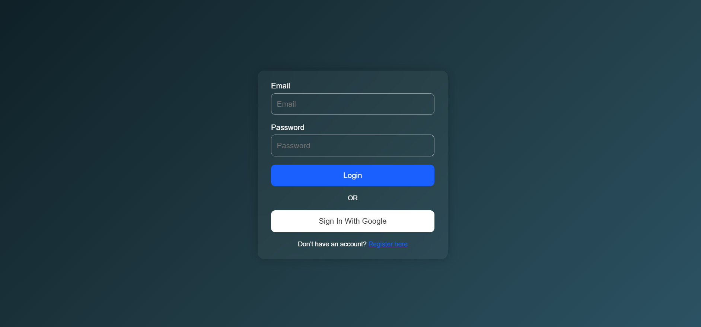
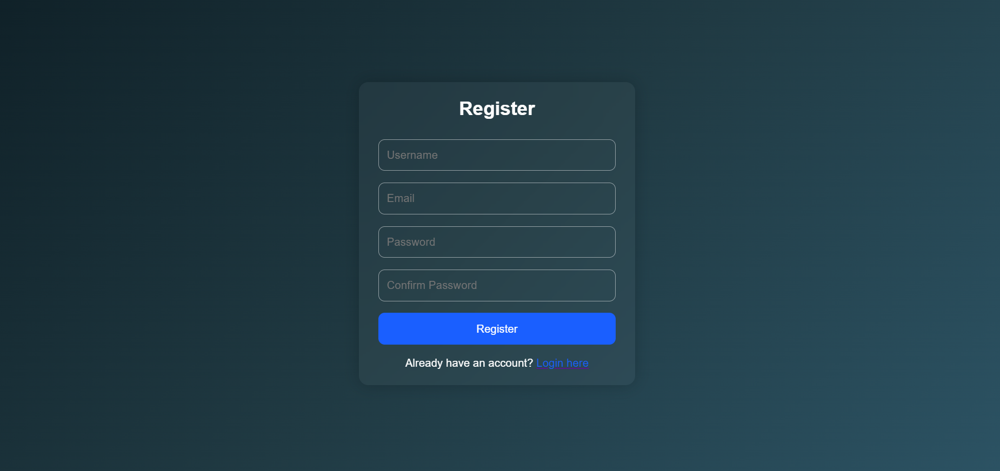
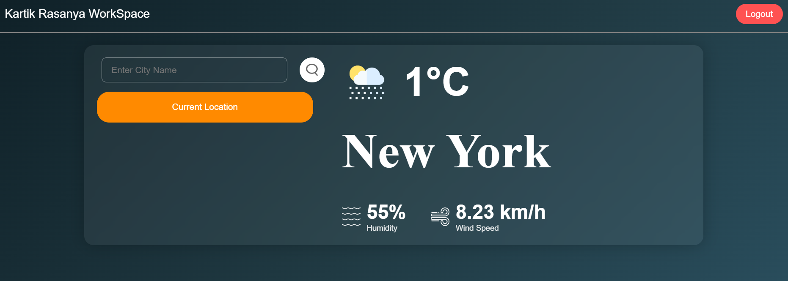

# Weather Web Application

## Description

So, this is a weather forecasting web application built with HTML, CSS, JS, Node.js, and Express.js. In this project, I have used SQL as a database for storing data and Node.js for creating the server. There is a login and register page where users can register themselves, which is managed by the database by storing user info and verifying it at the time of login. Users can directly log in with Google, which is integrated through Firebase. Here, I have integrated Firebase Google Authentication by creating a private key and establishing a connection with Firebase. For weather data retrieval, I have used a weather API by creating an API key and retrieving data based on the city name. To identify the current location, I have used the geolocation feature of the user's system to find longitude and latitude. All this frontend data is stored in the database by implementing routes and HTTP methods.

## Schema:

## login page:

## Register Page:

## Dashboard Page:

## Features

This is an Assessment Project called Weather Web Application. This project includes the following features:

1. Users can view the current weather forecast for a specific location.
2. Users can view the weather forecast for a specific city by entering the city name and country code.
3. This project includes the user interface, which can be modified according to Figma designs.
4. This project includes the backend REST API connection for handling Node.js routes.
5. This project includes a database connection with MySQL.
6. This project includes user authentication with Firebase for Google login.
7. This project stores user data inside the database.
8. It also stores the search history of users inside the database.

## How It Was Made

To create this project, you need knowledge of Node.js, Express.js, Firebase, SQL, HTML, CSS, JS, API fetching and handling, and how to request the current location using geolocation.

## Project Overview

Weather API Assessment is a full-stack web application designed to provide users with real-time weather information based on their location or specified parameters. The application incorporates user authentication, data storage, and dynamic content delivery, ensuring a seamless and secure user experience.

### Key Objectives

- **User Authentication:** Allow users to register, log in, and access personalized dashboards.
- **Real-Time Data:** Fetch and display up-to-date weather information using external APIs.
- **Data Management:** Store user data and preferences securely in a MySQL database.

## Architecture

The application's architecture follows a client-server model with a clear separation of concerns between the frontend and backend. Here's an overview of each component:

### A. Frontend

- **Technologies Used:** HTML, CSS, JavaScript
- **Frameworks/Libraries:** None (Vanilla JS used)
- **Hosting:** Firebase Hosting
- **Functionality:**
  - **Login & Registration Pages:** Enable user authentication via Firebase Authentication.
  - **Dashboard:** Display personalized weather data fetched from the backend.
  - **User Interaction:** Allow users to input parameters to fetch specific weather data.

### B. Backend

- **Technologies Used:** Node.js, Express.js
- **Functionality:**
  - **API Endpoints:** Handle user authentication, data fetching, and database interactions.
  - **Integration with Firebase Admin SDK:** Verify user tokens and manage user sessions.
  - **Database Connectivity:** Connects to a MySQL database for data storage and retrieval.

## Technologies Used

### A. Frontend

- **HTML & CSS:** Structuring and styling the web pages.
- **JavaScript:** Handling user interactions and making API calls to the backend.
- **Firebase Hosting:** Deploys and serves the static frontend files efficiently.

### B. Backend

- **Node.js:** Server-side JavaScript runtime environment.
- **Express.js:** Web framework for building API endpoints.
- **Firebase Admin SDK:** Facilitates secure interaction with Firebase services.
- **CORS Middleware:** Manages Cross-Origin Resource Sharing to allow frontend-backend communication.
- **dotenv:** Manages environment variables securely.

### C. Database

- **MySQL:** Relational database management system for storing and managing application data.
